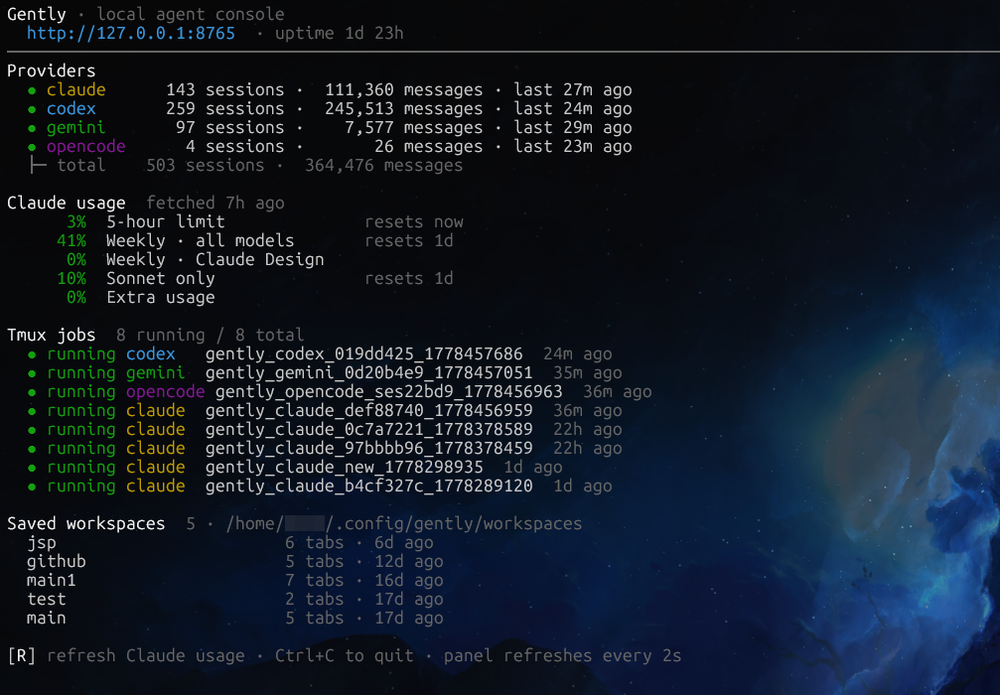
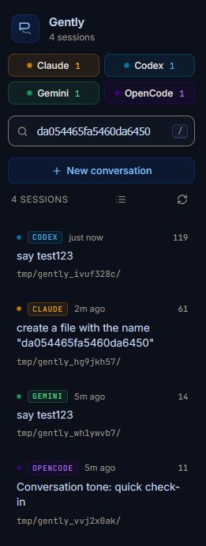
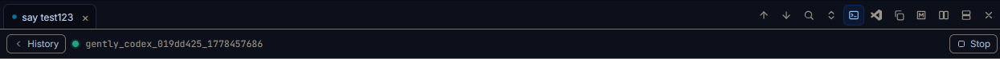
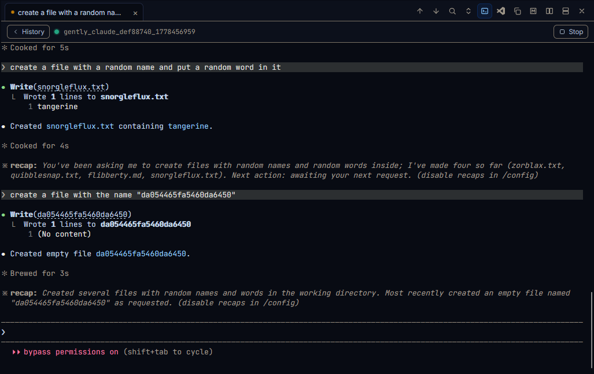
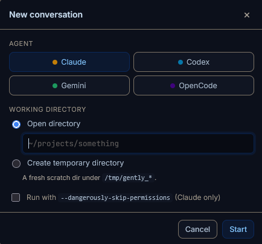
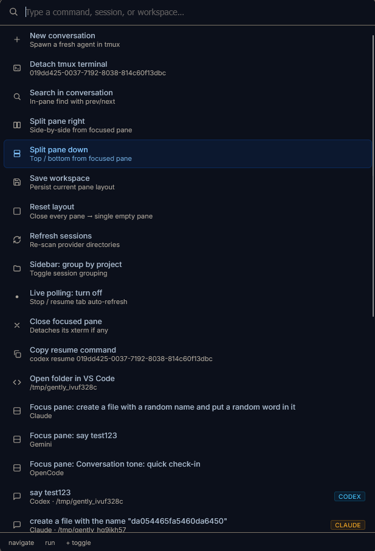
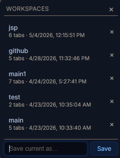

# Gently

A dashboard for multitasking with AI agents ✨

Monitor and search conversation history across Claude, Codex, Gemini, and OpenCode in one place

Resume or start sessions live, and run multiple agents in parallel across a split-pane workspace, without switching between terminals. 

Works on Linux & WSL (Ubuntu), not tested on macOS.

<video src="./screens/gently-demo.mp4" controls autoplay muted loop width="700"></video>

## Run

```bash
git clone https://github.com/Oblivios/gently.git
cd gently
python3 app.py
```

Open `http://127.0.0.1:8765`. The TUI dashboard takes the foreground; the HTTP server runs in a background thread. Ctrl+C exits.

Requirements: Python 3.10 or later, plus `tmux` for resume / new-conversation. The browser-side libs (marked, dompurify, highlight.js, xterm) load from a CDN.

---

## TUI dashboard



`python3 app.py` shows a foreground terminal dashboard. It displays:

- Per-provider session counts and most-recent activity
- Claude `/usage` (5-hour and weekly limits, resets, percentages)
- Saved workspace names
- Running tmux jobs
- Server uptime

Press `R` to refresh Claude usage (hits Anthropic's OAuth endpoint - rate-limited, so not automatic). Ctrl+C exits and stops the server.

---

## Sidebar



### Provider filter chips

Four chips at the top: Claude, Codex, Gemini, OpenCode. Click to toggle a provider on or off. At least one must stay active. Each chip shows its session count.

### Search

Type to search across all sessions. Single-word queries use prefix matching (`fast` finds `fastapi`). Multi-word queries use phrase matching (`random word in it` only matches that exact phrase in message bodies - not just any session containing those words separately).

The search runs two passes: a substring filter on session summary / project path / id, and a full-text FTS5 query against an indexed copy of every session's message bodies. Results are unioned and sorted by recency.

The index is built on first search (`~/.config/gently/index.sqlite`). A cold pass over hundreds of sessions takes ~80s; subsequent searches are under 200ms.

### Session list

Each card shows: provider badge, relative timestamp, session summary, message count, and project path (if available). Hover for the absolute timestamp.

**Keyboard navigation** (works from anywhere, not just when the search input is focused):

| Key | Action |
| --- | --- |
| `/` | Focus the search input and select all |
| `↑` / `k` | Move cursor up |
| `↓` / `j` | Move cursor down |
| `Enter` | Open the highlighted session in the focused pane |

The cursor (highlighted card) scrolls into view automatically.

### Rename a session

Double-click the session summary text to rename it inline. Press Enter to confirm, Escape to cancel. The custom name is stored in `localStorage` and applied whenever that session opens in a tab. Renaming from the sidebar also updates any open tabs showing that session.

### Group by project

The icon button next to the session count toggles between **recency** (flat list, newest first) and **project** (sessions grouped under their working directory, groups sorted by most recent activity). Click a project header to collapse or expand that group. Collapse state persists across reloads.

### Sidebar resizer

Drag the thin vertical strip between the sidebar and the workspace to resize. Double-click it to reset to the default width.

### Footer controls

- **Live** toggle - enables or disables the per-tab auto-polling loop (8s interval). Off while the browser tab is backgrounded regardless.
- **Workspaces** - opens the workspace popover (see [Workspaces](#workspaces) below).
- **Reset layout** - destroys all panes and creates one fresh empty pane (confirmation required).

---

## Workspace & panes



The workspace is a binary tree of panes split horizontally or vertically. Each pane has its own tab strip and pane controls.

### Splitting

Use the split buttons in the pane controls (far right of the header) to split right or split down. The new pane is empty and focused. Ratios start at 50/50.

### Resizing splits

Drag the resizer handle between two panes. The ratio is bounded between 12% and 88%. The layout is saved automatically on release.

### Swapping panes

Drag any pane header onto another pane to swap their positions. Sizes (flex ratios) stay put - only the content moves. Active xterm sessions survive the swap without flickering.

### Closing panes

The X button in pane controls closes the pane (disabled when it's the only pane). The sibling subtree collapses into the space.

### Pane focus

Click anywhere in a pane to focus it. The focused pane has a highlighted border. New sessions opened from the sidebar go into the focused pane.

### Tabs

Each pane has tabs. Click to activate. Middle-click or the × on the tab to close. Each tab tracks its own scroll position, terminal session, and search query independently.

**Rename a tab:** double-click the tab label to edit it inline. Enter to confirm, Escape to cancel. Also updates the sidebar override for that session.

### Pane control buttons

| Button | Action |
| --- | --- |
| ↑ prev-prompt | Jump to the previous user message |
| ↓ next-prompt | Jump to the next user message |
| 🔍 search | Toggle per-pane search bar |
| ⇅ expand | Expand or collapse all tool-call blocks in this pane |
| ⌨ terminal | Resume / detach the tmux session for the active tab |
| `</>` VS Code | Open the conversation's working directory in VS Code |
| ⧉ copy-resume | Copy the resume command for the active session |
| M copy-md | Copy the full conversation as Markdown |
| ▣▣ split right | Split the pane side by side |
| ▤ split down | Split the pane top / bottom |
| × close | Close this pane |

---

## Conversations

Each session opens in a pane and loads the latest 500 messages. A **Load earlier** button fetches the previous 500; **Load full conversation** fetches everything in one pass (warns that it may freeze briefly for very long sessions).

### Message bubbles

- **Copy button** - hover over any user or assistant bubble to reveal a copy icon (top-right corner). Click to copy the plain text of that message to the clipboard. The icon briefly shows a checkmark on success.
- **Inline images** - screenshots pasted into Claude or Codex sessions render as thumbnails. Click any image to open a fullscreen lightbox.
- **Tool calls** - collapsed by default inside `<details>`. The pane's expand-all toggle opens or closes all of them at once.
- **Thinking blocks** - similarly collapsible.
- **Diffs** - rendered with syntax highlighting when the tool result carries a structured patch.

### Scroll-to-bottom button

A circular button appears at the bottom center of any pane body when you scroll away from the latest messages. Click it to jump back. The button works in both history and terminal mode.

### Per-pane search

Click the magnifier button in pane controls (or use the palette's **Search in conversation**) to open the search bar. Matches are highlighted inline; the current match is scrolled into view.

| Shortcut | Action |
| --- | --- |
| `Enter` | Next match |
| `Shift+Enter` | Previous match |
| `Escape` | Close search bar |

---

## tmux / live terminal



Click the terminal button on any tab that has a session ID. Gently POSTs to `/api/tmux/start`, which starts a detached tmux session running the provider's resume command (e.g., `claude -r <id>`, `codex resume <id>`, `opencode -s <id>`), and opens an EventSource that streams the output into an xterm.js canvas.

**Per-tab sessions.** Each tab carries its own terminal state. Two tabs in the same pane can each have their own running tmux session. Switching tabs tears down the current xterm and remounts the new tab's (or shows history if the tab has no terminal).

**Session persistence.** Sessions survive server restarts. A sidecar JSON file at `/tmp/gently_tmux_logs/<session>.meta.json` lets Gently match the running tmux session back to its `(provider, session_id)` on reconnect, so re-clicking the terminal button reattaches instead of spawning a new one.

**Detach / reattach.** Click the **History** button in the terminal toolbar to detach - the tmux session keeps running, but the pane switches back to the history view. Click the terminal button again to remount the same session.

**Stop.** The **Stop** button in the toolbar kills the tmux session (confirmation required).

**Typing.** Keystrokes are coalesced: characters typed while a previous POST is in flight are buffered and sent in the next request. This keeps keystroke order guaranteed and cuts round-trips for fast typists.

**Scroll-to-bottom** in terminal mode is driven directly from xterm's viewport position - the same floating button as in history mode.

**Claude bypass permissions.** When resuming a Claude session, a dialog asks whether to launch with `--dangerously-skip-permissions`. OK = bypass on, Cancel = normal permissions mode.

### + New conversation



Click **+ New conversation** in the sidebar (or use `Ctrl+K`). Pick an agent, then either type a directory or select **Create temporary directory** (the server runs `tempfile.mkdtemp(prefix="gently_")`). For Claude, an optional `--dangerously-skip-permissions` checkbox is shown.

The conversation opens as an ephemeral tab (no session ID yet). After the agent writes its first session file, refresh the sidebar to find it in the list.

---

## Command palette



Press `Ctrl+K` (or `Cmd+K`) to open the palette. Press again or `Escape` to close. Click outside to dismiss.

Type to filter. Scoring: contiguous substring match → prefix match → subsequence match in label → subsequence match in subtitle.

**Default order when a resumable tab is active:**

| # | Command |
| --- | --- |
| 1 | New conversation |
| 2 | Resume in tmux / Detach tmux terminal |
| 3 | Search in conversation / Hide search bar |
| 4 | Split pane right |
| 5 | Split pane down |
| 6 | Save workspace |
| 7 | Reset layout |
| 8 | Refresh sessions |
| 9 | Sidebar: group by project / sort by recency |
| 10 | Live polling: on / off |
| 11 | Close focused pane |
| 12 | Copy resume command |
| 13 | Open folder in VS Code |
| 14 | Focus pane: … (one per other pane) |
| - | Loaded sessions (dynamic, filtered by query) |
| - | Load / Delete saved workspaces (dynamic) |

Navigate with `↑` / `↓`, run with `Enter`.

---

## Workspaces



The current pane layout (tabs, splits, scroll positions, terminal state, search queries) auto-saves to `localStorage` on every mutation. This survives page reloads automatically.

**Named workspaces** let you save snapshots on disk and reload them later. Open the Workspaces popover from the sidebar footer (or the palette). Type a name and press Enter to save. Load or delete from the list.

Workspace files live at `~/.config/gently/workspaces/<name>.json`. Names: 1–64 chars, letters/digits/space/dash/underscore.

---

## Keyboard reference

| Shortcut | Context | Action |
| --- | --- | --- |
| `/` | Global | Focus sidebar search |
| `↑` / `k` | Global | Move sidebar cursor up |
| `↓` / `j` | Global | Move sidebar cursor down |
| `Enter` | Global | Open highlighted session |
| `Ctrl+K` / `Cmd+K` | Global | Toggle command palette |
| `Escape` | Modals / search | Close / blur |
| `Enter` | In-pane search | Next match |
| `Shift+Enter` | In-pane search | Previous match |
| `Enter` | New conv. workdir input | Submit |

---

## Where it reads from

| Provider | Source | Format |
| --- | --- | --- |
| Claude | `~/.claude/projects/**/*.jsonl` | JSONL |
| Codex | `~/.codex/sessions/**/*.jsonl` | JSONL |
| Gemini | `~/.gemini/...` | JSON (old) + JSONL (v0.39+) |
| OpenCode | `~/.local/share/opencode/opencode.db` | SQLite (read-only) |

Override paths with env vars: `CLAUDE_DIR`, `CODEX_DIR`, `GEMINI_DIR`, `OPENCODE_DB`.

## Provider notes

**Claude.** The first user message in a session is often a synthetic environment-context block; Gently overrides the summary from `~/.claude/history.jsonl` when a cleaner prompt is available. Claude usage in the TUI reads from `~/.claude/.credentials.json` and calls Anthropic's `/api/oauth/usage` endpoint.

**Codex.** Resume command: `codex resume <id>`.

**Gemini.** Supports both the old single-document `.json` format and the newer JSONL format (introduced ~v0.39). Gemini resume requires the original project worktree to still exist on disk; `--resume <uuid>` only works when launched from the correct directory.

**OpenCode.** SQLite, opened read-only. Resume command: `opencode -s <id>`. The binary at `~/.opencode/bin/opencode` is used as fallback if `opencode` is not on `$PATH`.

---

## Configuration

| Env var | Default | Purpose |
| --- | --- | --- |
| `GENTLY_PORT` | `8765` | HTTP listen port |
| `GENTLY_VERBOSE` | unset | Log requests to stderr |
| `GENTLY_TMUX_LOG_DIR` | `/tmp/gently_tmux_logs` | tmux pane logs + sidecars |
| `GENTLY_INDEX_DB` | `~/.config/gently/index.sqlite` | FTS5 search index |
| `GENTLY_WORKSPACES_DIR` | `~/.config/gently/workspaces` | Named workspace store |
| `XDG_CONFIG_HOME` | `~/.config` | Config base directory |
| `CLAUDE_DIR` | `~/.claude` | |
| `CODEX_DIR` | `~/.codex` | |
| `GEMINI_DIR` | `~/.gemini` | |
| `OPENCODE_DB` | `~/.local/share/opencode/opencode.db` | |

## Flags

```
python3 app.py [--host HOST] [--port PORT] [--open]
               [--tui | --no-tui] [--tmux-reset]
```

`--open` auto-opens the browser. `--tui`/`--no-tui` force the dashboard on or off (default: on if stdout is a TTY). `--tmux-reset` kills every `gently_*` tmux session and cleans up log files, then exits.

## Limitations

- Single user, localhost only. No remote access, no auth.
- No editing of past messages. Read-only viewer + launcher.
- "Load full conversation" is synchronous and may freeze the UI for large sessions.
- Gemini resume requires the original project folder to still exist on disk.
- FTS5 index cold build is slow (~80s for 500+ sessions); subsequent searches are fast.

## Acknowledgments

Thanks to [@Romain](https://github.com/Rom1-J/) for coming up with the project name 🙏

## License

MIT
